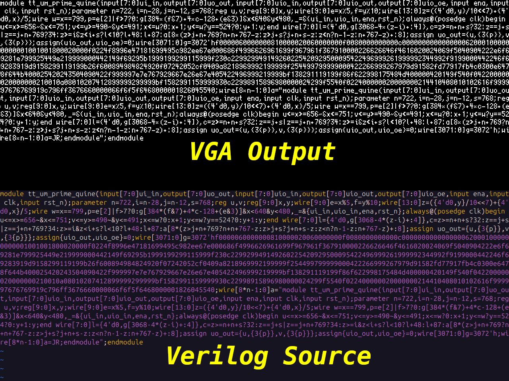

## How it Works

This is a standalone VGA demo that runs, intentionally, without input. All
input pins are unused, including the reset and enable pins. This project is
what is known as a [quine](https://en.wikipedia.org/wiki/Quine_(computing)). A
quine is generally a computer program which takes no input and a produces a
copy of its own source code as output. Typically, this involves creating a
specially formatted string of source code and the program emits that
approximate string once, and then one nearly like again. Typically, software
quines leverage a mountain of software abstractions that make it easier to
implement a quine in your language of choice. They generally build upon
standard libraries, operating systems, and other implicit software inputs that
are not included in the output. Verilog and other HDLs generally provide none
of this helpful abstraction.

If you inspect the source of this project, you will find two sections which are
nearly identical, separated by a long hexadecimal array, which encodes the
96-character visible ASCII character codes into a bitmap/pixel font. Each
character 4x8 pixels wide. The 640x480 VGA display output separates code
characters by one pixel in the horizontal direction and two pixels vertically.
That enables displaying up to 128x48 (6144) characters. While this limitation
could be problematic for binary encoding of the 3072 bits necessary for the
96-character 4x8 pixel font, we can encode 4 bits per hexadecimal value. This
results in a 768 character array, well within the character limitation. Since
the source array is approximately repeated twice within the quine, that leaves
us with about 2688 characters of Verilog. Since whitespace is only required
between keywords, techniques to limit the source array were used.
Consequently, the smaller sources minimizes the combinatorial logic required to
encode the source and makes for a smaller circuit. Multiple statements were
combined when possible, single character variables were used, and if a value
was used once, it was rolled into the calculation. Otherwise helpful
parentheses were deleted when order of operations could be leveraged instead.
The result is a very compact, nearly indecipherable blob of logic:

In my research I found [two](https://kbyte.io/projects/202011_vquine/)
[examples](https://codegolf.stackexchange.com/questions/99676/the-logical-quine)
of Verilog-based quines which output their own source over UART and have been
demonstrated to work on a small FPGA. To my knowledge this project is the first
Verilog quine to output with VGA signaling and also the world's first hardened
quine.

## How to Test

Plug into a VGA monitor and select this circuit to test. The circuit must be
clocked at (or very near) to **25.175 MHz**.

## External hardware

Requires the [TinyVGA PMOD](https://github.com/mole99/tiny-vga)
